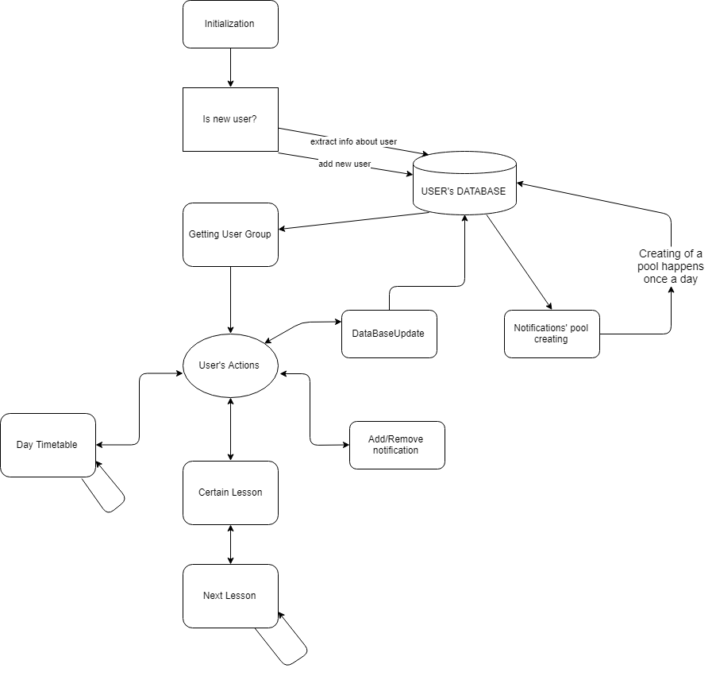

# Бот-расписание 
[](https://travis-ci.com/bully434/urfu-timetable-bot)

# Бот для быстрого получения расписания

## Функционал:
  * Отображение расписания на неделю, с учетом четности недели
  * Небольшая информация о занятии (преподаватель, аудитория, начало-конец)
  * Возможность выбора группы
  * Предупреждение о начале следующей пары 
  * Возможность добавления домашнего задания 
  
 ## Принцип работы:
   * Инициализируем пользователя, запоминаем только группу
   * Бот принимает на ввод название группы пользователя
   * Загружает расписание с сайта urfu.ru в формате .ics (iCalendar)
   * Предлагаем набор функций для взаимодействия с расписанием (см. **Работа с ботом**)
 
 ## Реализованный функционал:
   * Создана база данных с группами и их id
   * Основная часть (расписание на день, конкретная пара)
   * Клиент для консоли
    
## Формулировки ТЗ:
   * #### Задача 1
     * Console client;
     * Finite State Machine for dialogues;
     * Json database of users;
   
   * #### Задача 2 
     * Telegram Deploy;
     * Notifications about lessons;
   
   * #### Задача 3
     * Deploy on Heroku hosting;
     * Secure storage of TG_TOKEN in Heroku Config vars;
     * urfu.ru timetable parser;
   
## Работа с ботом

Узнать расписание на N-ый день:
```sh
$ расписание на (понедельник-суббота)
09:00: Дискретная математика
10:40: Экономическая теория
12:50: Объектно-ориентированное программирование
14:30: Дискретная математика
```

Узнать N-ую пару в M-ый день (+ спросить следующую):
```sh
$ (понедельник-суббота) (1-6) пара
Дискретная математика
Начало: 09:00
Конец: 10:30
Преподаватель: Расин Олег Вениаминович

$ следующая пара
Экономическая теория
Начало: 10:40
Конец: 12:10
Преподаватель: Баландина Марина Сергеевна
```

Добавить оповещение на пару:
```
$ добавить оповещение
Перед какой парой и в какой день хотите получать оповещение?

$ (1-6) <пара> (понедельник-суббота) 
С этого момента вы будете получать оповещения во %s перед %s парой
```

Удалить оповещение на пару:
```
$ удалить оповещение
Перед какой парой и в какой день хотите удалить оповещение?

$ (1-6) <пара> (понедельник-суббота) 
С этого момента вы не будете получать оповещения в %s перед %s парой
```

Изменить время оповещения на пару:
```
$ изменить время оповещения
За сколько минут до занятия вы хотите получать оповещение?

$ (1-6) <пара> (понедельник-суббота) на (1-60) <минут>
С этого момента оповещения о начале заняитий будут приходить за %s минут
```


## Авторы
| [<br /><sub><b>Roman Budlyanskiy </b></sub>](https://github.com/bully434)<br /> |
[<br /><sub><b>Vasiliy Pahomov </b></sub>](https://github.com/vaspahomov)<br /> |
|----------|----------|
